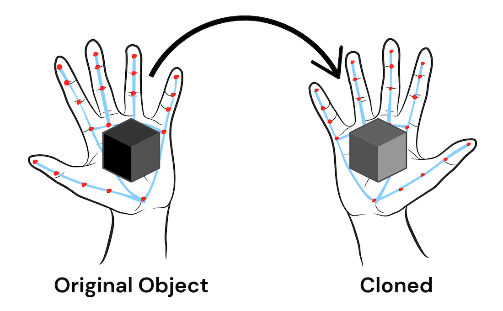

# Object Telecloning



## Overview

This project uses OpenCV and MediaPipe to detect and replicate objects in a virtual environment. It demonstrates a practical use case of computer vision and machine learning for creating interactive experiences.

## How It Works

1. **Hand and Face Detection**: MediaPipe is used to detect hands and facial landmarks in real-time.
2. **Data Processing**: Extracts key features from detected hands, faces, and objects within the hands.
3. **Virtual Cloning**: OpenCV is used to draw and replicate held objects based on the detected features.
4. **Interaction**: Allows users to interact with virtual object clones in real-time by blinking to clone and transfer (teleport) objects from one hand to another.

## Installation

1. Clone the repository:
   ```bash
   git clone https://github.com/NicoleStrel/object-telecloning.git
   ```
2. Navigate to the project directory:
   ```bash
   cd object-telecloning
   ```
3. Install the required dependencies:
   ```bash
   pip install -r requirements.txt
   ```

## Usage

1. Run the application:
   ```bash
   python teleclone.py
   ```
2. Hold up both hands in front of your face with an object in one hand.
3. Blink both your eyes to clone and transfer the object to the other hand.

## Demo Video

[Demo Video](https://youtu.be/RsZ-SOa-P1A)

## License

This project is licensed under the MIT License - see the [LICENSE](LICENSE) file for details.

## Acknowledgments

- [OpenCV](https://opencv.org/) for drawing and object replication.
- [MediaPipe](https://mediapipe.dev/) for hand and face detection.
